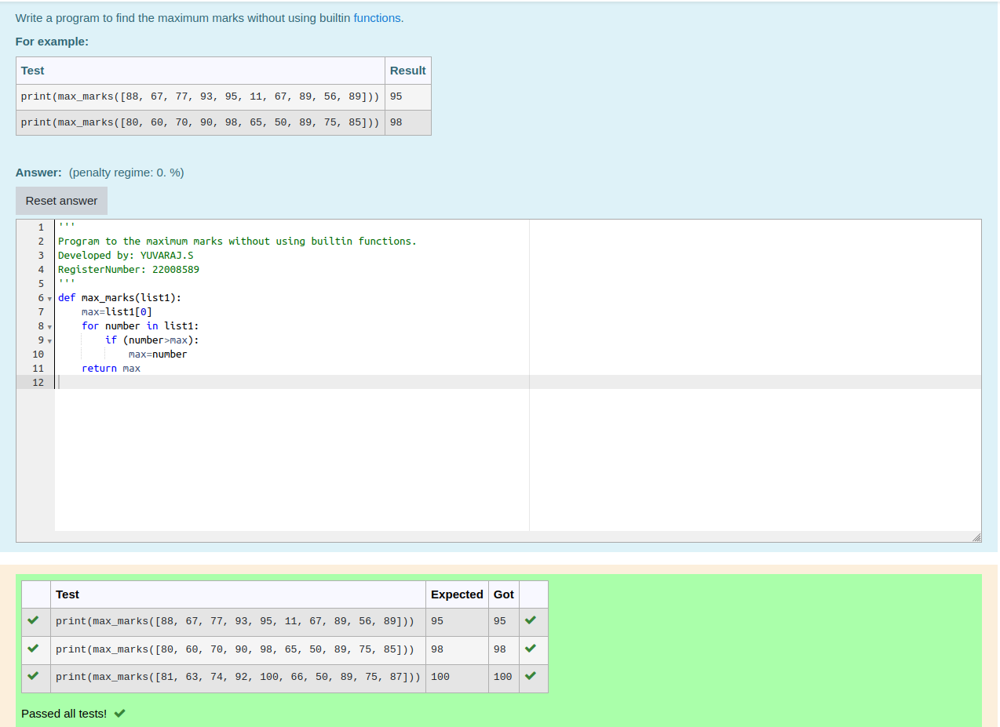

# Find the maximum of a list of numbers
## Aim:
To write a program to find the maximum of a list of numbers.
## Equipment’s required:
1.	Hardware – PCs
2.	Anaconda – Python 3.7 Installation / Moodle-Code Runner
## Algorithm:
1.	Get the list of marks as input
2.	Use the sort() function or max() function or use the for loop to find the maximum mark.
3.	Return the maximum value
## Program:
### To find the maximum of marks using the list method sort.
```
Program to mark the maximum of marks using the list method sort
Developed by: YUVARAJ.S
RegisterNumber: 22008589
def max_marks(marks):
 marks.sort()
 large=marks[-1]
 return large
 ```
### To find the maximum marks using the list method max().
```
Program to mark the maximum of marks using the list method sort
Developed by: YUVARAJ.S
RegisterNumber: 22008589
def max_marks(marks):
 large = max(marks)
 return large
 ```
 ### To find the maximum marks without using builtin functions.
```Python
Program to the maximum marks without using builtin functions.
Developed by:YUVARAJ.S
RegisterNumber: 22008589
def max_marks(marks):
 large=max(marks)
 return large
```
## Sample Input and Output
 

## Output:
### Output for the maximum of marks using the list method sort.

### Output for the maximum marks using the list method max().

### Output for the maximum marks without using builtin functions.

## Result:
Thus the program to find the maximum of given numbers from the list is written and verified using python programming.
